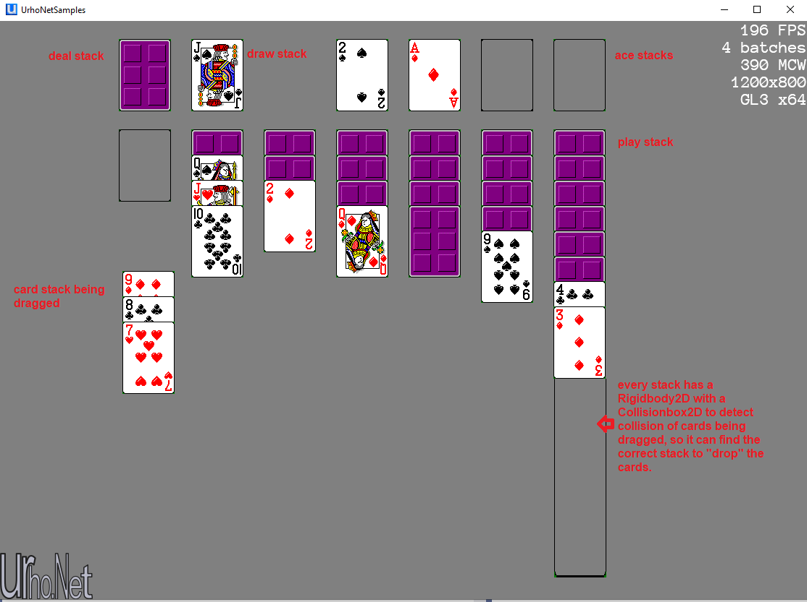

# Urho.Net CardGame Example
This is a simple solitaire card game to show usage of Urho.Net in creating a 2D game. 

https://github.com/Urho-Net/Urho.Net 

I also like the ECS framework for games. So, I took the "Node" in the scene to be an Entity and created a node processing system to manage the system part of ECS.

Using the "SceneComponent" from https://github.com/Urho-Net/Samples I added a node processing loop to manage the systems.  This allows me to use "AddNodeProcessing" method to separate updates of so many nodes.  This makes the original scene cleaner :-)

Entity = Urho scene Node

Component = Urho scene Component attached to nodes (Entity)

System = My NodeProcessingSystem

## SceneComponent
        protected override void OnUpdate(float timeStep)
        {
            //MoveCameraByTouches(timeStep);
            base.OnUpdate(timeStep);
            Global.DeltaTime = timeStep;
            //
            // Process node systems
            //
            if (NodeSystems.Count > 0)
            {
                foreach (NodeProcessingSystem ns in NodeSystems)
                    ns.Process();
            }
        }
        protected void AddNodeProcessing(NodeProcessingSystem _system)
        {
            NodeSystems.Add(_system);
        }

## Node Processing System
    public class NodeProcessingSystem
    {
        /*
         * The system part of ECS framework. Executed on every update frame
         * Allows for processing of Nodes outside of Scene component for separation of concerns
         * 
         * You can use the Tag property to group Nodes together or use Component to group them
         * See the Process method
         */
        public SceneComponent Scene;
        public Node[] Nodes;
        public string Tag;
        public bool Recursive;
        public NodeProcessingSystem(SceneComponent _scene, string _tag, bool _recursive = false)
        {
            Tag = _tag;
            Scene = _scene;
            Recursive = _recursive;
        }
        public virtual void Process()
        {
            //Nodes = Scene.MyScene.GetChildrenWithComponent<CardInfo>();
            //Nodes = Scene.MyScene.GetChildrenWithTag(Tag, Recursive);
            //foreach(Node nd in Nodes)
            //{

            //}
        }
    }
## Sample Screen

